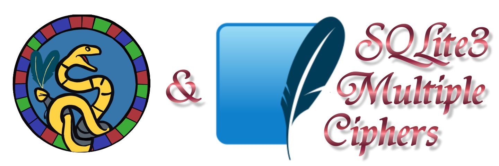

# utelle.github.io

My main focus in open-source software development is on developing components for [wxWidgets](https://www.wxwidgets.org) based applications.

The following components are under active development:

Component | Description
--- | ---
 | [SQLite3 Multiple Ciphers](https://utelle.github.io/SQLite3MultipleCiphers) - Encryption extension for [SQLite](https://sqlite.org) with support for multiple ciphers ([wxSQLite3](https://github.com/utelle/wxsqlite3), [sqleet](https://github.com/resilar/sqleet), [SQLCipher](https://www.zetetic.net/sqlcipher/), [System.Data.SQLite](https://system.data.sqlite.org/)).
 | [wxSQLite3](https://utelle.github.io/wxsqlite3) - SQLite3 database wrapper for wxWidgets (including SQLite3 encryption extension, since version 4.6.0 based on [SQLite3 Multiple Ciphers](https://utelle.github.io/SQLite3MultipleCiphers))
 | [wxPdfDocument](https://utelle.github.io/wxpdfdoc) - Generation of PDF documents from wxWidgets applications
 | [wxChartDir](https://utelle.github.io/wxchartdir) - Support for using the [ChartDirector](https://www.advsofteng.com/) charting library in wxWidgets applications
 | [APSW SQLite3 Multiple Ciphers](https://github.com/utelle/apsw-sqlite3mc) - _Python3_ SQLite Wrapper based on the combination of [Roger Binns'](https://github.com/rogerbinns) [APSW](https://pypi.org/project/apsw) SQLite wrapper and [SQLite3 Multiple Ciphers](https://utelle.github.io/SQLite3MultipleCiphers) to support reading and writing of encrypted SQLite databases from _Python_ applications.
